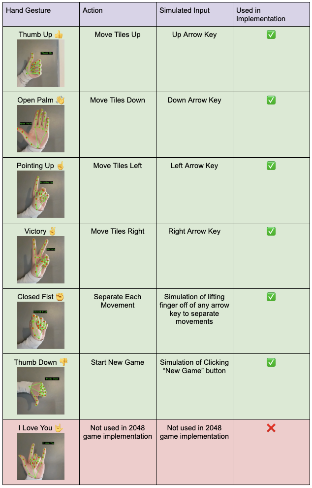

# Gesture Controlled 2048

This project implements gesture-based controls for the game **2048** using **MediaPipe**, **OpenCV**, and **PyAutoGUI**.  
Hand gestures detected through a webcam are translated into keyboard and mouse inputs to control the game.

---

## Requirements

Install the required Python libraries:

```bash
pip install opencv-python
pip install mediapipe
pip install pyautogui
```

You must also ensure the following model files are located in the main `Gesture_Recognizer` directory:

- gesture_recognizer.task

- hand_landmarker.task

## Running the Project

1. Navigate into the project directory:

    ```bash
    cd Gesture_Recognizer
    ```

2. Confirm the `2048_demo.py` script is present

    On **Mac/Linux**:
      ```bash
      ls
      ```

    On **Windows**
      ```bash
      dir
      ```

    You should see the file: 
      `2048_demo.py`

3. Run the script:
    ```bash
    python 2048_demo.py
    ```

4. Open the game in your browser: [Open 2048 Game](https://play2048.co/)


## Gesture Controls

